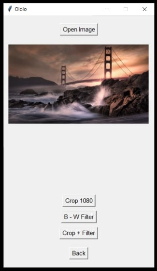
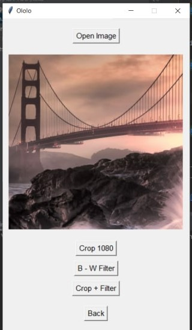
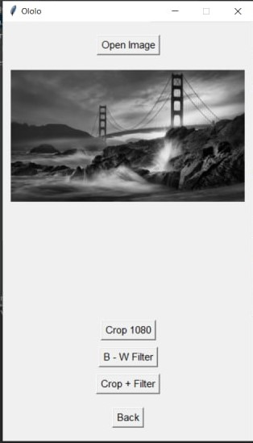
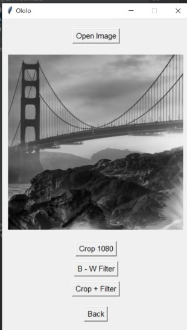

Ololo App
===============
This python app is used to add filters and image processing
___


## Setup

1. Install Pillow

```
pip install Pillow
```

2. Run script

```
python main.py
```

## Menu



## 1. Crop 1080



## 2. Black and White filter



## 3. Mixed



## 4. Copyright page


